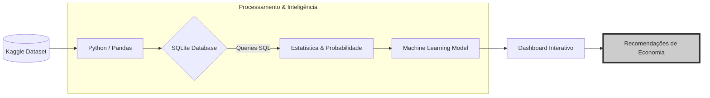

# 🚀 SmartConsumer Insight Engine

Projeto desenvolvido para o Hackathon Elas+ Tech - Ada Tech, sob o tema **Consumo Inteligente**. O foco é a análise de padrões de consumo, com o desafio de aplicar estatística exploratória para classificar gastos e identificar categorias dominantes. A solução inclui a construção de um modelo em Python e painéis focados em gerar recomendações de economia ou identificar produtos mais rentáveis.

Índice:
- [1. Visão Geral e Proposta de Valor](#1-visão-geral-e-proposta-de-valor)
- [2. Arquitetura da Solução](#2-arquitetura-da-solução)
- [3. Execução Técnica](#3-execução-técnica)
- [4. Insights Estratégicos (Storytelling)](#4-insights-estratégicos-storytelling)
- [5. MVP Interativo (Streamlit)](#5-mvp-interativo-streamlit)
- [6. Como Executar o Projeto](#6-como-executar-o-projeto)
- [7. Integrantes do Esquadrão](#7-integrantes-do-esquadrão)
- [8. Conclusão](#8-conclusão)
- [Referências](#referências)

---

## 1. Visão Geral e Proposta de Valor

O **SmartConsumer Insight Engine** é uma solução de dados de ponta a ponta (E2E) desenvolvida para ajudar consumidores individuais a otimizar sua saúde financeira. Através da análise de padrões de consumo, identificamos **"vilões"** do orçamento e prevemos gastos futuros para gerar recomendações práticas de economia.

- **Público-alvo:** Usuários finais que buscam inteligência financeira e controle de gastos.
- **Problema:** Dificuldade em identificar padrões de gastos supérfluos e prever o fechamento da fatura mensal.

## 2. Arquitetura da Solução

Nossa solução segue um pipeline estruturado para garantir a integridade dos insights:

- **Ingestão:** Carga do dataset spending_patterns_detailed.csv (Kaggle).
- **Camada de Dados (SQL):** Criação de banco SQLite e extração de faturamento por categoria.
- **Processamento Estatístico:** Aplicação de estatística descritiva e probabilidade condicional para validar comportamentos de consumo.
- **Inteligência (Machine Learning):** Modelo preditivo para estimativa de gastos futuros.
- **Visualização (Storytelling):** Dashboard interativo com foco em recomendações estratégicas.

## 3. Execução Técnica

### 🛠 SQL na Prática

Demonstramos o uso de SQL para extrair insights estruturados diretamente do banco de dados, focando em:

- Cálculo da participação percentual de cada categoria no faturamento total.
- Segmentação de gastos por método de pagamento para identificar o impacto do crédito.

### 📊 Estatística e Probabilidade

A análise não é baseada em suposições, mas em fatos estatísticos:

- **Probabilidade Condicional:** "Qual a chance de uma compra ser via Mobile App dado que a categoria é Shopping?".
- **Métricas Descritivas:** Identificação da moda (itens mais frequentes) e dispersão dos gastos.

### 🤖 Machine Learning

Construímos um modelo de **Regressão Linear** via Scikit-Learn para prever o gasto total de uma transação.

- **Features:** Quantidade e Preço Unitário.
- **Objetivo:** Antecipar o impacto de compras no orçamento e validar a tendência de gastos baseada no histórico.

## 4. Insights Estratégicos (Storytelling)

Nosso painel de visualização destaca descobertas que orientam a tomada de decisão:

- **O Gatilho do Crédito:** Usuários tendem a gastar mais em lazer quando utilizam cartão de crédito.
- **Destaque de Vendas:** O motor de busca compara o perfil do usuário com o benchmark de mercado (onde Alimentação representa a maior fatia em 68% dos casos).
- **Efeito Sazonal:** Identificação de picos de consumo em novembro (Black Friday).

## 5. 🌐 MVP Interativo (Streamlit)

Desenvolvemos um protótipo funcional para que o usuário possa interagir com o SmartConsumer Insight Engine em tempo real.

**Funcionalidades**:

- **Calculadora Preditiva:** Insira a quantidade e o preço de um item para prever o impacto na fatura mensal.
- **Dashboard Dinâmico:** Visualize os "vilões do orçamento" através de gráficos interativos do Plotly.
- **Como rodar o MVP localmente:**
  - Na raiz do projeto, execute: `streamlit run app/app.py`
  - O sistema abrirá automaticamente uma aba no seu navegador com a interface do projeto.

A solução **SmartConsumer Insight Engine** está disponível para testes em tempo real. O deploy foi realizado via **Streamlit Cloud**, permitindo que você interaja com as predições e insights sem a necessidade de configuração local.

**🔗 Link do Web App:** *https://smartconsumer.streamlit.app/*

**Funcionalidades da Versão Online:**

- **Upload de Dados:** Carregue arquivos CSV compatíveis para análise instantânea.
- **Calculadora Preditiva:** Simule compras e veja a estimativa da fatura gerada pelo nosso modelo de ML.
- **Insights SQL Dinâmicos:** Visualização imediata do ranking de categorias e gatilhos de consumo.

## 6. Como Executar o Projeto

Você pode explorar o **SmartConsumer Insight Engine** de duas maneiras:

**1. Execução Online (Google Colab)**

Esta é a forma mais rápida de visualizar o projeto funcionando sem configurar nada em sua máquina.

- Acesse o notebook através do link [Colab Notebook](https://colab.research.google.com/drive/1RbyDN91t44Ow2r3Dr7vuHsMc89W3dcNn?usp=drive_link).
- Vá em - Vá em **Arquivo** > **Salvar uma cópia no Drive**.
Execute as células sequencialmente para ver o pipeline de dados em ação.

**2. Execução Local (Sua Máquina)**

Para rodar o projeto localmente, siga estes passos:
- **Clone o repositório:**

`git clone https://github.com/mydevslab/smartConsumer-insight-engine.git`

- **Instale as dependências:**

Certifique-se de ter o **Python** instalado e rode o comando abaixo para instalar as bibliotecas necessárias (`pandas`, `scikit-learn`, `plotly` e `sqlite3`):
`pip install -r requirements.txt` (O projeto exige Streamlit 1.36+ para alinhamento visual dinâmico).

- **Abra o Notebook:**

Navegue até a pasta `/notebooks` e abra o arquivo `.ipynb` usando o **Jupyter Notebook** ou **VS Code**.

- **Base de Dados:**

O projeto utiliza o dataset do **Kaggle**. Caso o download automático não seja iniciado pelo script, baixe-o [neste link](https://www.kaggle.com/datasets/ashishpatel26/spending-patterns-detailed) e coloque-o na raiz do projeto.

## 7. Integrantes do Esquadrão

1. [Jéssica](https://www.linkedin.com/in/jessicalopesena/)
2. [Juscélia](https://www.linkedin.com/in/jusceliadesouza)
3. [Katherina](https://www.linkedin.com/in/katherina-melin-hoehne/)
4. [Rozvania](https://www.linkedin.com/in/rozvania/)

## 8. Conclusão

O **SmartConsumer Insight Engine** é uma ferramenta poderosa para capacitar consumidores a entender e controlar seus hábitos de consumo. Através de uma abordagem baseada em dados, oferecemos insights acionáveis que podem transformar a saúde financeira dos usuários, promovendo um consumo mais consciente e inteligente.

## 9. Referências

Segue a lista de referências utilizadas para a construção do projeto:

- [Dataset Kaggle: Spending Patterns Detailed](https://www.kaggle.com/datasets/ashishpatel26/spending-patterns-detailed)
- [Documentação SQLite](https://www.sqlite.org/docs.html)
- [Documentação Pandas](https://pandas.pydata.org/docs/)
- [Documentação Scikit-Learn](https://scikit-learn.org/stable/)
- [Documentação Plotly](https://plotly.com/python/)

---

**Nota:** Este projeto é uma simulação para fins educacionais e não deve ser utilizado como aconselhamento financeiro real.
